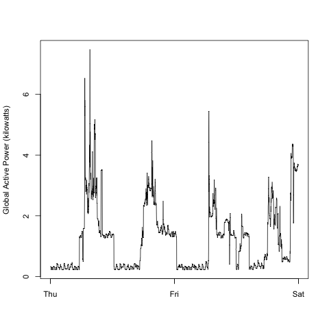
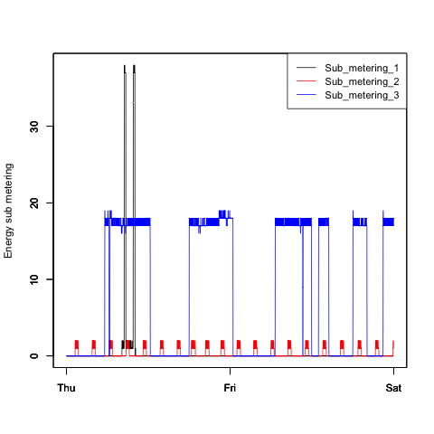
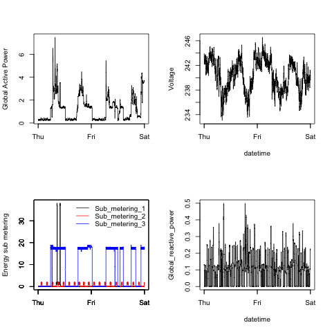

## **Plotting Data:** Individual household electric power consumption

This dataset can be found on at the UC Irvine Machine Learning Repository (http://archive.ics.uci.edu/ml/).

It is the "Individual household electric power consumption" dataset, which is a 20Mb file containing over 2 million rows and 9 columns on the usage of electrical power in a single household. Measurements were taken every minute for almost four years.

**Below are some descriptions of the data variables, taken from:**
https://archive.ics.uci.edu/ml/datasets/Individual+household+electric+power+consumption

**Attribute Information:**

1.**date**: Date in format dd/mm/yyyy 

2.**time**: time in format hh:mm:ss 

3.**global_active_power**: household global minute-averaged active power (in kilowatt) 

4.**global_reactive_power**: household global minute-averaged reactive power (in kilowatt) 

5.**voltage**: minute-averaged voltage (in volt) 

6.**global_intensity**: household global minute-averaged current intensity (in ampere) 

7.**sub_metering_1**: energy sub-metering No. 1 (in watt-hour of active energy). It corresponds to the kitchen, containing mainly a dishwasher, an oven and a microwave (hot plates are not electric but gas powered). 

8.**sub_metering_2**: energy sub-metering No. 2 (in watt-hour of active energy). It corresponds to the laundry room, containing a washing-machine, a tumble-drier, a refrigerator and a light. 

9.**sub_metering_3**: energy sub-metering No. 3 (in watt-hour of active energy). It corresponds to an electric water-heater and an air-conditioner.


## Subsetting the data and pre-processing

Here, we choose only two days to get a sense of what the data is like. As you can see below, I have selected only Feb. 1 and Feb. 2 of 2007.
```{r}
## Importing and cleaning up the electric consumption data for Feb. 1 and Feb. 2, 2007.

#Read data from rows 65000 to 70000, which encompass 2007-02-01 and 2007-02-02, no Headers
setwd("/Users/polong/Dropbox/Coursera/DataScienceSpecialization/exdata-002")
df <- read.table("household_power_consumption.txt", skip = 65000, nrows = 5000, header = FALSE, sep = ";")
df <- df[df[,1] %in% c("1/2/2007","2/2/2007"),]

#Add headers from the file
vars <- unlist(strsplit(readLines("household_power_consumption.txt", n = 1), ";"))
names(df) <- vars

#Create column, datetime, that combines Date and Time
df$Date <- as.character(df$Date)
df$Time <- as.character(df$Time)
df$Datetime <- strptime(paste(df$Date,df$Time), format = "%d/%m/%Y %H:%M:%S")

#Create column, Weekday, column for week day
df$Weekday <- as.factor(weekdays(as.Date(df$Datetime)))
```

## Plot1: Global Active Power by Frequency
Below is a histogram showing the distribution of global active power by frequency. Recall that each datapoint is a measurement, and measurements were recorded once per minute. As you can see, many measurements were recorded when no power was being used (0 kilowatts), and the second most common measurement was approximately 0.75 kW.

```{r}
###########
# Plot 1  #
###########

hist(df$Global_active_power, 
     col = "red", # makes column colour red
     xlab = "Global Active Power (kilowatts)", # label x-axis
     main = "Global Active Power", # label y-axis
     cex.lab = 0.72, #smaller text on labels
     cex.axis = 0.72, #smaller text on axes
     cex.main = 0.9, #smaller title
     bg = "transparent"
)

#Save as PNG
# dev.copy(png, file = "plot1.png", width = 480, height = 480)
# dev.off()
```

 

## Plot2: Energy consumption across time
Below is a line plot showing how energy consumption changed across time. Recall that measurements were done once per minute, and we see the recordings across the two full days: from Thursday until the end of Friday.

We can clearly spot peaks in the data, with several consistent periods of inactivity, suggesting that electrical power was not consumed during certain hours of the day. This is most likely because electricity was not used when the resident(s) were asleep at night.


```{r}
###########
# Plot 2  #
###########

plot(df$Datetime, df$Global_active_power, type = "l",
     xlab = "",
     ylab = "Global Active Power (kilowatts)",
     cex.axis = 0.72,
     cex.lab = 0.72,
     bg = "transparent")


#Save as PNG
# dev.copy(png, file = "plot2.png", width = 480, height = 480)
# dev.off()
```

 

## Plot3: Electrical consumption by type of appliance

Below we can see how the electrical power usage changed across time, depending on the type of appliace. 

Sub_metering 1 measures kitchen appliances, including the dishwasher, and according to the plot, these appliances are rarely used. However, when in use, they consume quite a bit of electrical power relative to other appliances.

Sub_metering 2 measures laundry room appliances, including a laundry machine and a refridgerator. There are regular, small peaks in usage, which may correspond to how a refridgerator turns on and off to maintain a cool temperature.

Finally, Sub_metering 3 measures air conditioner and water heater electrical consumption. The usage, as seen in the plot, appears to correspond well with daytime, and can reflect the usage of air conditioning (or perhaps if the weather is cold - hot water) during the day.


``` {r}
###########
# Plot 3  #
###########

#Sub metering 1
plot(df$Datetime, df$Sub_metering_1, type = "l", ylim = c(0, 38),
     xlab = "",
     ylab = "Energy sub metering",
     cex.axis = 0.72,
     cex.lab = 0.72)

#Sub metering 2
par(new = T)
plot(df$Datetime, df$Sub_metering_2, type = "l", ylim = c(0, 38), col = "red",
     xlab = "",
     ylab = "",
     cex.axis = 0.72,
     cex.lab = 0.72)

#Sub metering 3
par(new = T)
plot(df$Datetime, df$Sub_metering_3, type = "l", ylim = c(0, 38), col = "blue",
     xlab = "",
     ylab = "",
     cex.axis = 0.72,
     cex.lab = 0.72)

#Legend
legend("topright", lty = 1, cex = 0.70, y.intersp = 0.9, col = c("black", "red", "blue"), legend = c("Sub_metering_1", "Sub_metering_2", "Sub_metering_3"))


# #Save as PNG
# dev.copy(png, file = "plot3.png", width = 480, height = 480)
# dev.off()
```

 

```{r}
###########
# Plot 4  #
###########

#Export plots directly to plot4.png, script must end with dev.off()
# png(filename = "plot4.png", width = 480, height = 480)

#Two-by-two grid of plots
par(mfrow =c(2,2))

#### Top-left ####

plot(df$Datetime, df$Global_active_power, type = "l",
     xlab = "",
     ylab = "Global Active Power",
     bg = "transparent")


#### Top-right ####

plot(df$Datetime, df$Voltage, type = "l",
     xlab = "datetime",
     ylab = "Voltage",
     bg = "transparent")

#### Bottom-left ####

#Sub metering 1
plot(df$Datetime, df$Sub_metering_1, type = "l", ylim = c(0, 38),
     xlab = "",
     ylab = "Energy sub metering")

#Sub metering 2
par(new = T)
plot(df$Datetime, df$Sub_metering_2, type = "l", ylim = c(0, 38), col = "red",
     xlab = "",
     ylab = "")

#Sub metering 3
par(new = T)
plot(df$Datetime, df$Sub_metering_3, type = "l", ylim = c(0, 38), col = "blue",
     xlab = "",
     ylab = "")

#Legend
legend("topright", lty = 1, y.intersp = 0.95, col = c("black", "red", "blue"), bty = "n", legend = c("Sub_metering_1", "Sub_metering_2", "Sub_metering_3"))


#### Bottom-right ####

plot(df$Datetime, df$Global_reactive_power, type = "l",
     xlab = "datetime",
     ylab = "Global_reactive_power",
     bg = "transparent")


#### Save as PNG ####
#dev.copy(png, file = "plot4.png", width = 480, height = 480)
# dev.off()
```

 